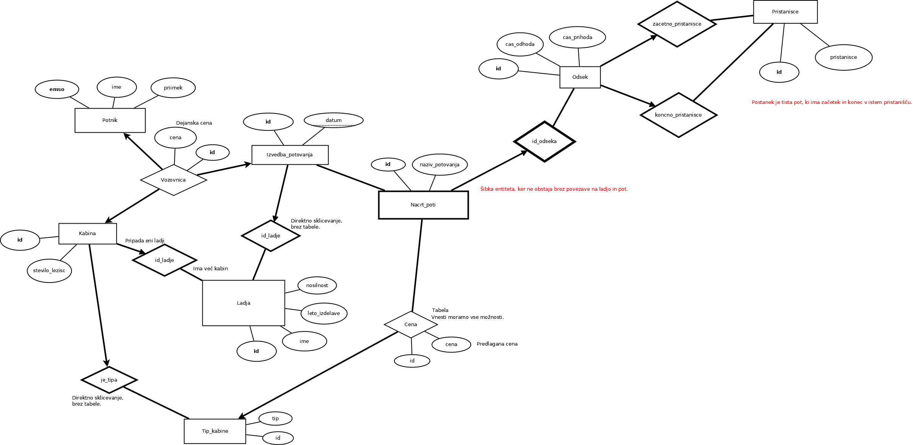

# Pristanisce
Projekt pri predmetu Podatkovne baze

## Zagon

Program zaženemo preko datoteke  ali .

## Možne izboljšave
- Olajšano dodajanje odsekov poti
- Prijava administratorja
- Registracija potnikov
- Izpis celotnega itinerarija pri nakupu vozovnic
- Uporaba javascript-a
- Preglednejše tabele za administratorja pri dodajanju v bazo
- Preprečitev dodajanja praznih okenc

## ER diagram

